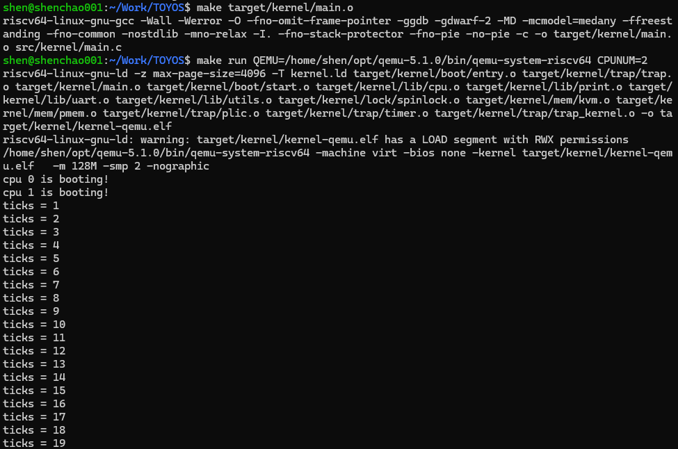
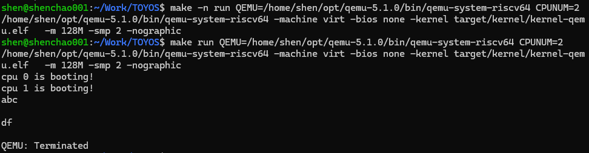

## Lab-3：中断与异常初步（个人完成记录）

### 1. 实验目标

本实验为内核建立基础的 trap 处理框架，实现 UART 外设中断和时钟中断。内核能够在正常执行流被设备事件打断后保存现场、处理事件并恢复执行，为后续进程调度、系统调用和用户态支持准备基础设施。

### 2. 新增功能与实现效果

#### 2.1 M-mode 到 S-mode 的中断准备

在 `start.c` 中完成 trap 委托和时钟初始化：

- 将可委托的异常与中断交给 S-mode 处理；
- 使能 S-mode 的外设中断、时钟中断和软件中断；
- 每个 hart 在 M-mode 设置自己的时钟比较值、`mscratch` 和 `mtvec`；
- 保留 Lab-1 的 `mepc + mret` 启动迁移，使内核进入 S-mode 的 `main()`。

时钟相关寄存器 `MTIME`、`MTIMECMP` 只能在 M-mode 访问，因此硬件时钟中断首先进入 `timer_vector`。该入口更新下一次触发时间，再设置 S-mode 软件中断，使后续内核逻辑在 S-mode 中完成。

#### 2.2 S-mode trap 框架

新增 `trap.S` 与 trap 模块：

- `kernel_vector` 在进入 C 语言处理函数前保存通用寄存器；
- `trap_kernel_handler()` 读取 `scause`，按 trap 原因分派处理逻辑；
- 外设中断进入 `external_interrupt_handler()`；
- 软件中断进入 `timer_interrupt_handler()`；
- 完成处理后恢复寄存器，并通过 `sret` 返回被打断的内核执行流。

Lab-3 当前重点处理 S-mode 软件中断和 S-mode 外设中断。未支持的异常或中断会输出错误信息并进入 `panic`，避免内核在未知状态下继续运行。

#### 2.3 UART 输入中断与回显

通过 PLIC 配置 UART 外设中断的优先级和使能状态。UART 输入到达后，内核通过 `plic_claim()` 获取 IRQ 编号；确认是 UART 中断后调用 `uart_intr()`，处理结束后使用 `plic_complete()` 通知 PLIC。

`uart_intr()` 支持：

- 普通字符直接回显；
- Enter 的回车符统一显示为换行；
- Backspace 同时兼容 `'\b'` 与 `0x7f`，通过“左移、空格覆盖、再左移”实现视觉删除。

#### 2.4 系统计时器

新增 `timer_t` 全局系统时钟对象，其中包含 `ticks` 和自旋锁。`timer_create()` 初始化计数器和锁，`timer_update()` 安全递增 tick，`timer_get_ticks()` 提供受锁保护的读取接口。

两个 hart 都可能收到时钟相关中断，因此只由 CPU 0 更新共享的 `ticks`；自旋锁保证读写接口在后续扩展时仍具有明确的并发语义。

### 3. 与前两个实验的逻辑联系

Lab-1、Lab-2、Lab-3 共同构成内核第一阶段的基础设施：

| 实验  | 已完成能力                          | 为 Lab-3 提供的基础                                                          |
| ----- | ----------------------------------- | ---------------------------------------------------------------------------- |
| Lab-1 | 启动链、双核启动、UART 输出、自旋锁 | trap 处理依赖启动后的 S-mode 内核；`printf` 用于诊断；自旋锁保护 `ticks`。   |
| Lab-2 | 物理页分配、Sv39 内核页表、设备映射 | 内核页表已映射 UART、PLIC、CLINT，使 S-mode 可以访问中断控制器和设备寄存器。 |
| Lab-3 | trap、UART 输入中断、时钟中断       | 内核获得响应外设与周期性事件的能力，为进程调度、系统调用和用户态支持铺路。   |

Lab-3 把 Lab-2 中“已经映射但尚未实际使用”的 PLIC、CLINT 设备接入执行流；也让 Lab-1 中的 UART 输入接口真正通过中断机制工作起来。

### 4. 验证记录

运行环境：

```bash
make clean
make build
make run QEMU=/home/shen/opt/qemu-5.1.0/bin/qemu-system-riscv64 CPUNUM=2
```

使用 QEMU 5.1.0 和双核配置启动。内核能够输出两颗 CPU 的启动信息。

#### 4.1 时钟滴答测试

临时在 CPU 0 中读取并打印 `ticks`。默认 `INTERVAL = 1000000` 时，tick 持续递增，证明 M-mode 时钟中断、S-mode 软件中断和计时器更新链路均正常工作。



随后临时将 `INTERVAL` 调整为 `5000000`，观察到 tick 输出速度明显降低；测试完成后已恢复默认值 `1000000`。

#### 4.2 UART 输入测试

输入普通字符 `abc` 能正常回显；按 Enter 后能换行；输入 `de`、Backspace、`f` 后，终端最终显示 `df`，验证 Backspace 的视觉删除逻辑。


