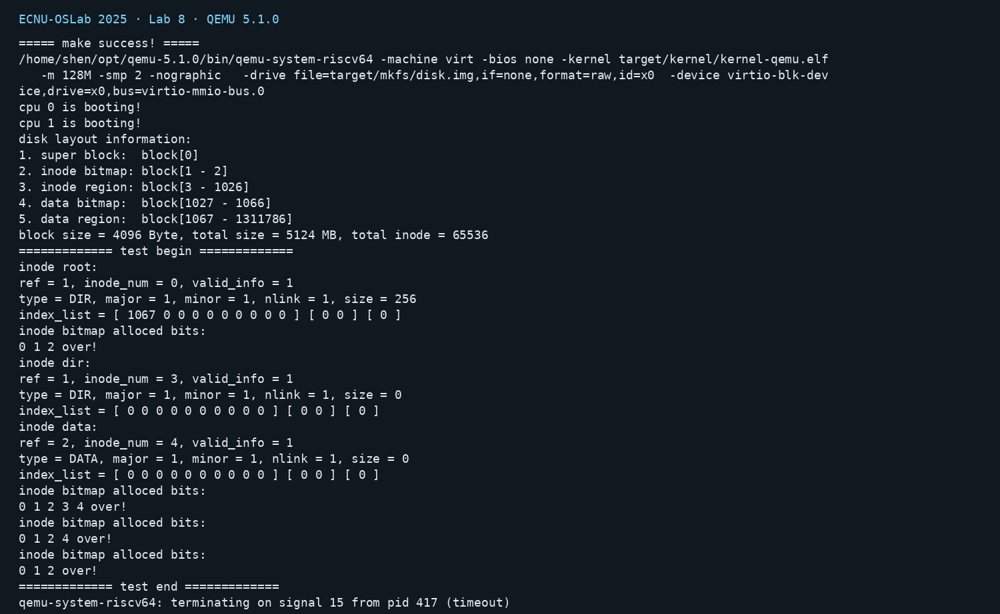
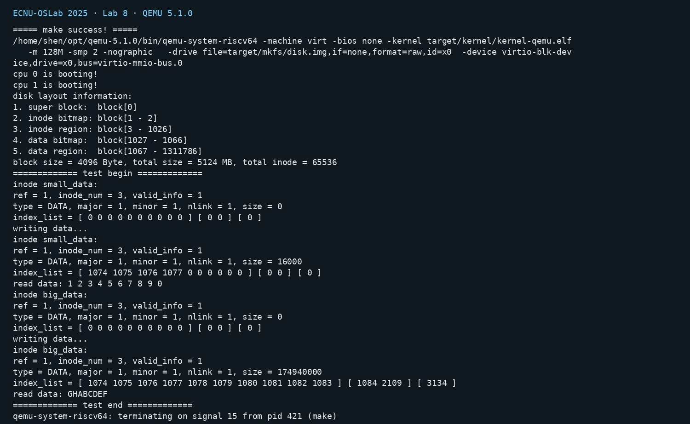
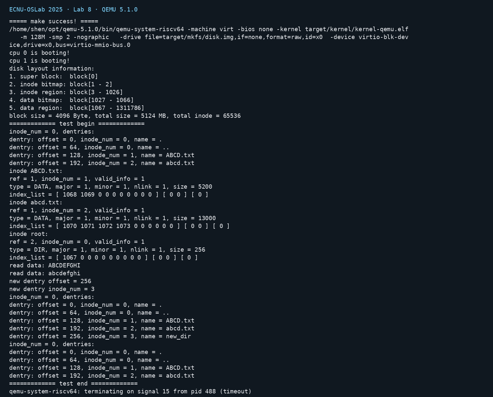
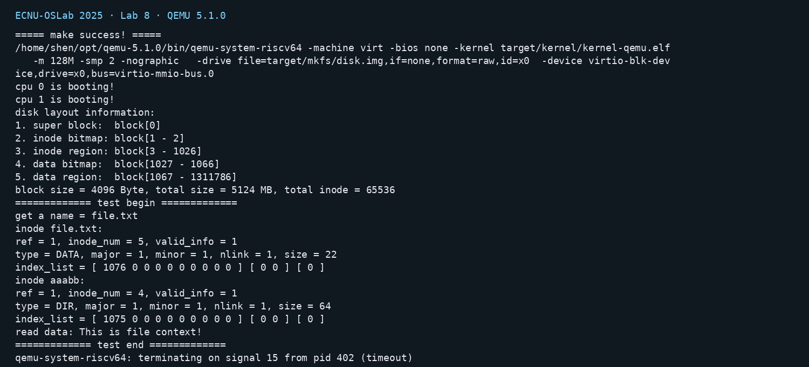
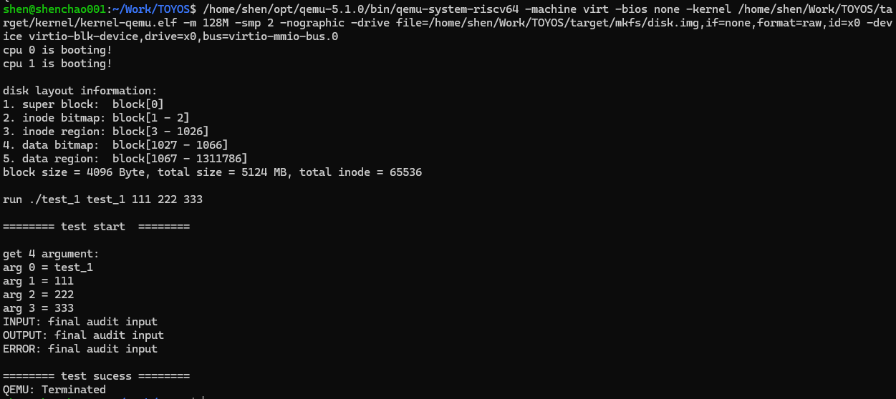
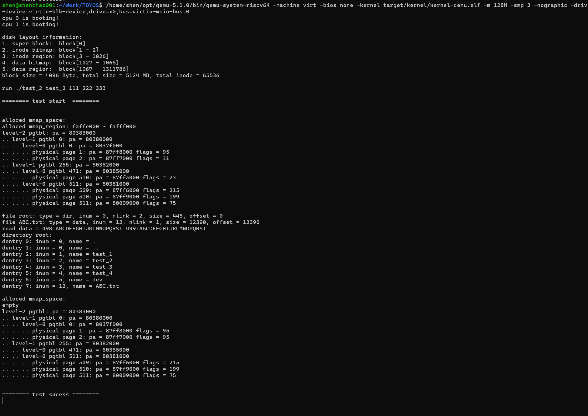
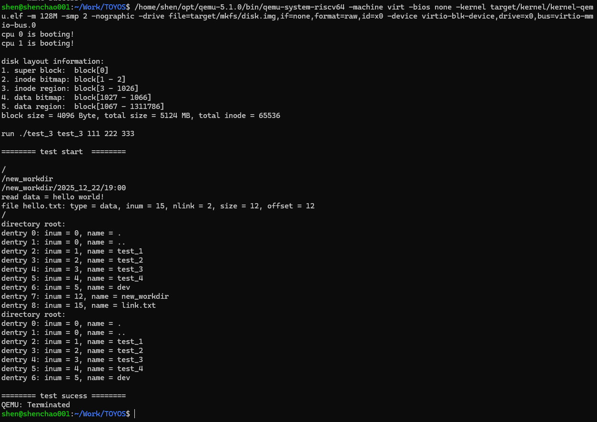
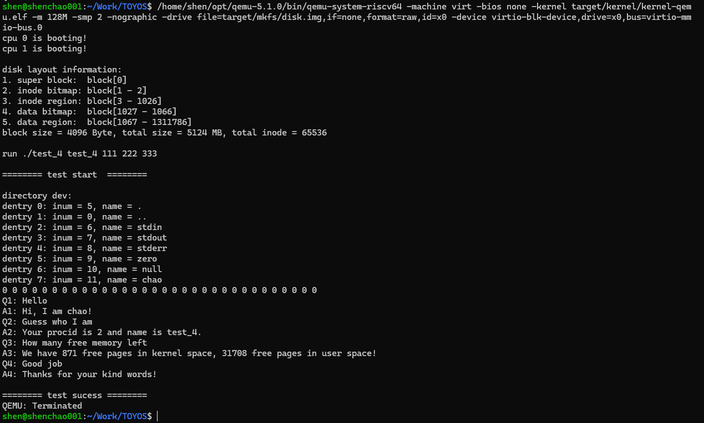

## Lab-8：文件系统之上层抽象

### 1. 实验目标与实现

Lab-8 在 Lab-7 的 VirtIO、buffer cache、superblock 和 bitmap 之上，补齐 inode、目录项（dentry）和绝对路径解析，使磁盘块能够组织成普通文件与多层目录。实现包含 64 项 inode cache、inode 磁盘元数据同步、10 个直接索引、2 个一级间接索引和 1 个二级间接索引；目录项固定为 64B，支持名称查找、创建、删除以及 `.`、`..` 根目录初始化

inode 数据读写按逻辑块分段，经 buffer cache 访问磁盘；新建索引块先清零再写盘，删除 inode 时递归释放数据块和各级索引块。普通文件拒绝产生空洞的 `offset > size` 写入，并用无溢出方式检查 `INODE_MAX_SIZE`。路径解析从 inode 0 开始，支持连续 `/`；失败路径会释放已经取得的 inode 引用

复查阶段额外确认：新分配的数据块会清零，索引块分配失败不会把无效块号留在 inode 中，目录项创建会拒绝超出 superblock 范围的 inode 号；删除后重新分配同一数据块的隔离测试已读回零填充

mkfs 已预置根目录 inode 0、`ABCD.txt` inode 1 和 `abcd.txt` inode 2，并保留 64 位 `off_t` 块偏移计算，确保 5GB 镜像可以从干净构建中正确生成。Makefile 同时依赖 `mkfs.c` 与 `mkfs.h`，源码改变后会重新制盘。

### 2. 验证环境与结果

测试使用双 hart、QEMU 5.1.0、4096B block 和 `N_BUFFER = N_BUFFER_TEST = 8`。每组测试都先精确重建 `target/mkfs/disk.img`，避免持久化目录项互相污染。教师 Test-2 的大文件读取对象在测试前已释放，实际验证时改为仍持有的大文件 inode `ip_2`；大文件源缓冲区使用静态数组，避免环境中物理页不保证连续导致的无关失败。

| 测试   | 验证内容                              | 实际 QEMU 结果                                                                                                                           |
| ------ | ------------------------------------- | ---------------------------------------------------------------------------------------------------------------------------------------- |
| Test 1 | inode cache、创建、引用计数与最后释放 | 根 inode 为 0、DIR、size 256；创建 inode 3/4 后 bitmap 为 `0 1 2 3 4`，释放后恢复为 `0 1 2`，无 panic。                                  |
| Test 2 | 小文件、一级和二级索引、大文件读回    | 小文件 size 16000、直接块 1074--1077；大文件 size 174940000，直接块 1074--1083、一级索引 1084/2109、二级索引 3134，末尾读回 `GHABCDEF`。 |
| Test 3 | 目录项查找、创建、删除与空槽复用      | 根目录初始项位于 0/64/128/192，新目录写入偏移 256，删除后恢复四个初始项，并正确读回预置文件内容。                                        |
| Test 4 | 多层绝对路径与父目录解析              | `name=file.txt`；目标 inode 5、父目录 inode 4，文件 size 22、数据块 1076，读回 `This is file context!`。                                 |

Test 1：



Test 2：



Test 3：



Test 4：



## Lab-9：文件系统之文件管理与全系统整合

### 1. 实验目标

Lab-9 在 Lab-7 的 VirtIO、buffer cache、superblock 和 bitmap，以及 Lab-8 的 inode、目录项和路径解析之上继续向上构建。实验的核心目标是引入进程可见的文件抽象，把普通文件、目录文件和设备文件统一接入读写接口；同时让进程拥有文件描述符表和当前工作目录，支持相对路径、目录操作、硬链接和设备访问。最后通过 `fork + exec` 从磁盘加载用户态 ELF 程序，并用 22 个系统调用完成完整的用户态测试链路。

本实验还要求保持前八次实验的内存、陷阱、进程调度、磁盘和文件系统能力稳定。`initcode` 作为祖先进程启动后，创建子进程并执行 `test_1` 至 `test_4`；每组测试都应完成自己的检查并输出 `test sucess`。

### 2. 实现内容

#### 2.1 构建流程、内存和控制台

在 `src/loader/` 中保留内核链接脚本并新增用户链接脚本，使每个 `test_*.c` 独立链接为磁盘中的用户 ELF。Makefile 将 `initcode`、四个用户 ELF、内核目标和 mkfs 源码建立依赖关系；mkfs 接收多个 ELF 输入，把它们写入新建镜像的根目录。mkfs 的块偏移继续使用 64 位 `off_t`，因此约 5.1 GiB 的镜像不会发生 32 位偏移回绕。

`pmem_stat` 分别在内核页池和用户页池锁保护下返回可分配页数；`uvm_heap_grow` 接受页权限参数，exec 装载代码段时可以按 ELF 标志设置权限。新增的 `console.c` 把 UART 输入组织成行缓冲，支持普通字符、Enter、Backspace 和 Ctrl+U；标准输入通过该缓冲提供给用户程序，标准输出和标准错误分别连接到对应设备。

#### 2.2 dentry、路径和文件抽象

Lab-8 已有的目录项和绝对路径能力在本实验中补齐为：

- `dentry_search_2` 根据 inode 号反查目录项名称，`dentry_transmit` 只传输有效目录项。
- `inode_to_path` 通过 `..` 目录项从当前目录逆向回溯到根目录，支持 `sys_print_cwd`；父链增加 inode 总数级别的深度上限，损坏目录不会形成无限循环。
- `path_create_inode`、`path_link` 和 `path_unlink` 分别完成 inode 创建、硬链接和链接删除，并维护目录项、父目录链接数和 inode 引用。
- `path_to_inode` 结合进程的 `cwd` 解析绝对路径和相对路径，连续斜杠、`.` 和 `..` 均沿用统一的路径语义。

新增的 `file_t` 记录 inode 指针、读写权限、读写偏移和引用数；全局 `file_table` 由文件表锁保护。`file_open` 为进程获得一个独立的 file 对象，`file_dup` 共享 file 对象并增加引用，`file_close` 在引用归零后释放 inode。普通文件执行流式读写，目录文件传输结构化目录项，设备文件转交给设备表中的读写函数。目录允许读取，写模式打开目录会返回失败，避免把目录当作普通数据文件写入。

#### 2.3 设备文件

`device_init` 注册六种设备并确保 `/dev` 中的节点存在；节点已存在时会校验类型和主次设备号，重复启动不会重复创建或触发断言。

| 设备 | 行为 | 权限 |
| --- | --- | --- |
| `/dev/stdin` | 行缓冲标准输入 | 只读 |
| `/dev/stdout` | 标准输出 | 只写 |
| `/dev/stderr` | 写入前输出 `ERROR: ` | 只写 |
| `/dev/zero` | 返回任意长度的零字节 | 只读 |
| `/dev/null` | 读返回 0 字节，写接受全部数据 | 读写 |
| `/dev/chao` | 对四个预设问题给出回答 | 只写 |

教师骨架采用原实验命名；本实现按个人实验约定改为 `/dev/chao`，保留主设备号 7、只写权限和四个问答分支，设备文件测试的覆盖范围不变。

`device_open_check` 按主设备号和读写模式检查接口是否存在；普通文件层不直接假设设备的读写能力，从而避免打开只支持单向操作的设备。

#### 2.4 进程、文件描述符和当前工作目录

`proc_t` 新增进程文件描述符表和 `cwd` 字段。proczero 创建时打开 stdin、stdout、stderr 并把 cwd 设置为根 inode；`proc_fork` 通过 `file_dup` 和 `inode_dup` 继承父进程的文件和工作目录；`proc_free` 关闭所有文件并释放 cwd。exec 完成地址空间替换时保留进程的 fd 表和 cwd，文件资源的生命周期与进程生命周期保持一致。

#### 2.5 ELF exec

`proc_exec` 采用事务式流程：先读取并校验 ELF header，创建新的页表和 trapframe，再按顺序检查和装载 LOAD 段，准备用户栈和 argv，全部成功后才替换当前进程的旧地址空间。代码段和数据段进入用户堆，BSS 由新分配页的清零语义保证；trapframe 设置 argc、argv、入口 PC 和栈指针，进程的 `heap_top`、`ustack_npage`、`mmap` 和 name 在提交阶段一起更新。

装载器会检查文件范围、`mem_size >= file_size`、地址范围、页对齐、段权限、段顺序和入口地址。无 LOAD 段、段重叠或倒置、入口落在未加载空洞中的异常 ELF 会在提交前返回失败，旧进程资源不会被提前销毁。

### 3. 22 个系统调用

内核编号、分发表、服务函数、用户声明和用户封装保持同步，当前正式系统调用为：

| 编号 | 系统调用 | 作用 |
| ---: | --- | --- |
| 1 | `brk` | 调整用户堆边界 |
| 2 | `mmap` | 创建匿名内存映射 |
| 3 | `munmap` | 解除内存映射 |
| 4 | `fork` | 复制进程 |
| 5 | `wait` | 等待子进程退出 |
| 6 | `exit` | 退出进程 |
| 7 | `sleep` | 睡眠指定 tick |
| 8 | `getpid` | 获取当前 PID |
| 9 | `exec` | 执行磁盘中的 ELF |
| 10 | `open` | 按路径打开文件 |
| 11 | `close` | 关闭文件描述符 |
| 12 | `read` | 读取文件或设备 |
| 13 | `write` | 写入文件或设备 |
| 14 | `lseek` | 移动文件偏移 |
| 15 | `dup` | 复制文件描述符权限 |
| 16 | `fstat` | 获取文件状态 |
| 17 | `get_dentries` | 获取有效目录项 |
| 18 | `mkdir` | 创建目录 |
| 19 | `chdir` | 切换当前工作目录 |
| 20 | `print_cwd` | 打印当前绝对路径 |
| 21 | `link` | 建立硬链接 |
| 22 | `unlink` | 删除目录项并解除链接 |

`sys_mmap` 对长度、对齐、用户地址范围和显式地址重叠进行检查；`sys_munmap` 要求请求区间完整包含于已有映射，非法参数返回 `-1`，避免进入底层断言路径。文件系统系统调用在取得资源后均维护失败回滚和 inode/file 引用释放。

### 4. 与前序实验的联系

Lab-7 解决了块设备、buffer cache、superblock 和 bitmap，建立了可靠的磁盘块分配基础；Lab-8 把块组织为 inode、目录项和层次路径；Lab-9 在此基础上增加 file、进程 fd、cwd、设备和 ELF exec，把持久化文件系统连接到用户态程序。整体数据流可以概括为：

```text
VirtIO 块设备
    ↓
buffer cache / bitmap / superblock
    ↓
inode / dentry / path
    ↓
file_t / 进程 fd 表 / cwd / device
    ↓
22 个系统调用
    ↓
fork + exec + 用户态 test_1~test_4
```

其中 inode 保存可持久化的文件元数据，file 保存一次打开操作的权限和偏移，进程 fd 表把 file 暴露给用户程序，dentry 和 cwd 决定路径如何定位 inode；设备文件沿用相同的 file 接口，但把读写操作分派到内存中的设备函数。

### 5. 验证环境与构建结果

本轮使用个人 WSL 仓库 `/home/shen/Work/TOYOS`，分支为 `lab-9`；课程 QEMU 为 `/home/shen/opt/qemu-5.1.0/bin/qemu-system-riscv64`，配置为 `virt`、无 BIOS、`-m 128M`、`-smp 2`、`-nographic`，磁盘块大小为 4096B，`N_BUFFER = N_BUFFER_TEST = 8`。每组测试前都用同一版本的四个用户 ELF 重新生成干净镜像。

最终默认入口为 `src/user/initcode.c` 中的 `./test_1`。完整 `make -B build` 成功，生成物如下：

| 生成物 | 大小或属性 |
| --- | --- |
| `target/kernel/kernel-qemu.elf` | 357432 bytes，RISC-V ELF64 |
| `target/user/test_1.elf` | 37984 bytes，RISC-V ELF64 |
| `target/user/test_2.elf` | 39376 bytes，RISC-V ELF64 |
| `target/user/test_3.elf` | 39472 bytes，RISC-V ELF64 |
| `target/user/test_4.elf` | 39536 bytes，RISC-V ELF64 |
| `target/mkfs/disk.img` | 5373079552 bytes，约 5124 MB |

五个 ELF 均存在有效 LOAD 段，`nm -u` 未发现未解析符号。链接器报告的 `LOAD segment with RWX permissions` 是课程链接脚本当前布局产生的已知警告；除此之外，`-Wall -Werror` 构建通过。

### 6. 官方测试结果

测试入口通过修改 `src/user/initcode.c` 的 path 和 `arg0` 选择，验证完成后已恢复默认 `test_1`。每次测试结束使用 QEMU monitor 的 `Ctrl+A`、`X` 正常退出。

| 测试 | 覆盖内容 | 当前源码实测结果 |
| --- | --- | --- |
| Test 1 | exec 参数、argc/argv、stdin、stdout、stderr | 输入 `final audit input` 后得到原文回显、`ERROR: final audit input` 和 `test sucess`；参数为 `test_1/111/222/333`。 |
| Test 2 | root fstat、普通文件 500 次写入、lseek 回读、目录项枚举、dup/close、mmap 清理 | root inode 为 0、size 为 448；`ABC.txt` inode 为 12、size/offset 为 12390；读回尾部包含 `498` 和 `499`，目录项顺序正确，最后映射为空。 |
| Test 3 | cwd、mkdir、相对路径、硬链接、fstat、unlink | cwd 依次为 `/`、`/new_workdir`、`/new_workdir/2025_12_22/19:00`、`/`；读回 `hello world!`，`hello.txt` 的 nlink 为 2，删除后根目录恢复。 |
| Test 4 | `/dev` 目录、zero/null、chao | 列出七个 `/dev` 条目并读到 32 个零值；输入 `Hello`、`Guess who I am`、`How many free memory left`、`Good job` 分别覆盖 chao 四个合法分支，最终输出 `test sucess`。 |

另外使用临时用户态断言补测了三类失败边界：已映射区间的重叠 `mmap`、未映射或超范围的 `munmap` 均返回 `-1`；以 `OPEN_WRITE` 打开根目录被拒绝。临时测试代码已在验证后移除，没有进入最终源码。

### 7. 证据状态与后续工作

上述测试结果来自个人 QEMU 终端实测，教师目录 `ecnu-oslab-2025-task-lab-9/picture/` 只用于对照输出结构，没有作为个人运行证据。个人 Lab-9 终端截图已归档到仓库 `pictures/`，并保留输入、关键输出和 `test sucess`。

四张个人截图已归档到仓库 `pictures/`，原始文件来自 `lab-pictures\lab9`，并保留输入、关键输出和 `test sucess`：

Test 1：



Test 2：



Test 3：



Test 4：



当前尚未专门注入损坏 ELF、非法 fd、fd 耗尽、非空目录删除拒绝或重复压力场景。`git commit -s` 和 push 属于后续交付步骤，生成的 `target/`、`disk.img` 和 `src/user/initcode.h` 继续按 `.gitignore` 排除。
