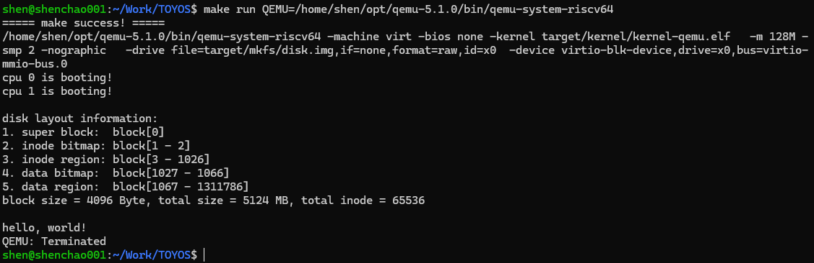
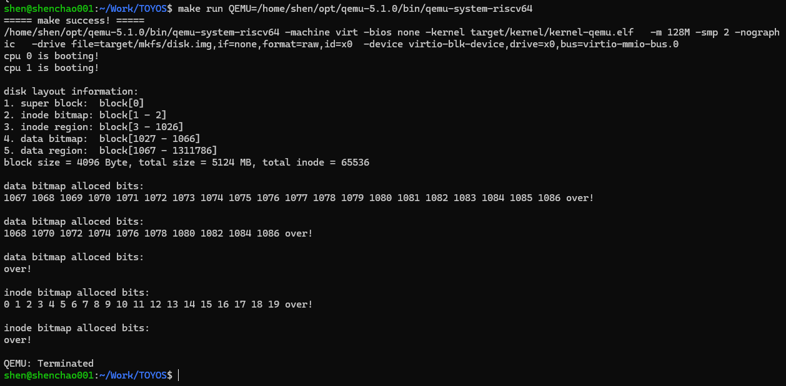
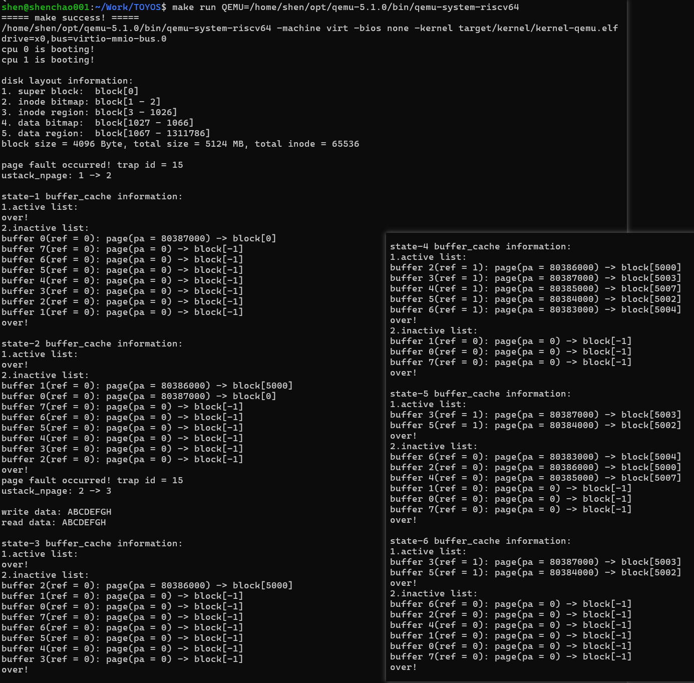
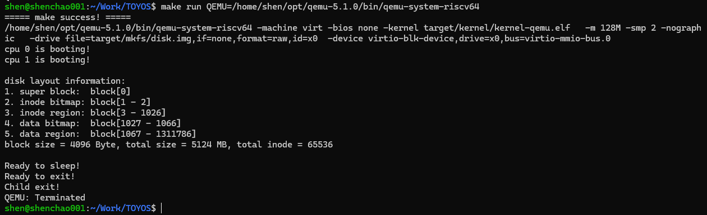

## Lab-7：文件系统之磁盘管理

### 1. 实验目标

Lab-7 在 Lab-6 已具备调度、睡眠唤醒和睡眠锁的基础上，引入 QEMU VirtIO 块设备，建立文件系统最底层的磁盘管理能力。实验以 block 为基本单位完成磁盘镜像初始化、异步块读写、内存 buffer cache、superblock 读取和 inode/data bitmap 管理。

本实验完成以下功能：

1. 使用 Linux 侧 `mkfs` 生成并格式化 `disk.img`，写入文件系统 superblock。
2. 在内核页表、PLIC 和外设中断路径中接入 VirtIO 块设备。
3. 使用 active/inactive 双向循环链表实现带引用计数的 buffer cache。
4. 在 `proczero` 的进程上下文中完成 buffer 初始化与 superblock 读取。
5. 实现 data block 和 inode 的 bitmap 申请、释放与显示。
6. 增加 11 个 Lab-7 系统调用，并完成三组官方测试。
7. 回归验证 Lab-6 的 `fork`、`sleep`、`exit` 和 `wait`。

### 2. 磁盘镜像、VirtIO 与中断路径

`mkfs` 使用 `open + lseek + write + close` 创建 `disk.img`。镜像布局如下：

```text
[ superblock | inode bitmap | inode region | data bitmap | data region ]
```

block 大小为 4096 Byte。实际运行时，superblock 位于 block 0；inode bitmap 为 block 1--2；inode region 为 block 3--1026；data bitmap 为 block 1027--1066；data region 为 block 1067--1311786，总 inode 数为 65536。生成的镜像大小为 5,373,079,552 Byte。

`mkfs` 中的块偏移使用 64 位 `off_t` 计算，并以创建、截断方式打开镜像，保证超过 4 GiB 的磁盘镜像可以从干净构建中正确生成。

QEMU 通过 `-drive` 和 `virtio-blk-device` 挂载镜像。内核在 `kvm_init()` 中映射 `VIRTIO_BASE` MMIO 页面，在 PLIC 中设置并使能 `VIRTIO_IRQ`，并在外设中断处理中调用 `virtio_disk_intr()`。`virtio_disk_rw()` 提交 I/O 后，当前进程通过 Lab-6 的 `proc_sleep()` 等待；磁盘中断到达后由 `proc_wakeup()` 唤醒。

```text
mkfs -> disk.img -> VirtIO block device
     -> VirtIO MMIO / PLIC IRQ 1
     -> virtio_disk_rw / virtio_disk_intr
     -> buffer cache -> superblock / bitmap -> system calls
```

### 3. Buffer cache 与磁盘读写

每个 `buffer_t` 记录对应的磁盘 `block_num`、数据页 `data`、引用计数 `ref`、睡眠锁 `slk` 和 VirtIO 使用的 `disk` 标记。全局自旋锁保护链表、块号和引用计数；每个 buffer 的睡眠锁保护块数据和耗时的磁盘 I/O。

buffer cache 由 active 和 inactive 两个带头节点的双向循环链表组成。active 链表中的 buffer 正被引用，inactive 链表中的 buffer 可以被复用或释放物理页。`buffer_get()` 先查 active，再查 inactive；若均未命中，则从 inactive 链表末端复用最久未使用的节点。`buffer_put()` 在引用归零时将节点放回 inactive 链表头部。`buffer_freemem()` 仅回收 inactive buffer 的数据页，因此不会破坏仍被使用的块。

Test-3 的实际输出展示了 buffer 在 active/inactive 链表间的移动、引用计数变化及 `flush` 后的数据页回收。

### 4. Superblock 与 bitmap 管理

`fs_init()` 不能在内核启动阶段直接运行，因为读取磁盘时可能睡眠。系统因此在 `proczero` 第一次进入 `proc_return()`、且已经释放进程锁后执行 `fs_init()`：初始化 buffer cache，读取 block 0，复制全局 superblock，释放 buffer，并检查魔数、块大小和区域边界。

bitmap 以 bit 为单位记录资源是否已分配。`bitmap_alloc_block()` 和 `bitmap_alloc_inode()` 从前向后扫描每个 bitmap block，设置首个空闲 bit 并写回磁盘；`bitmap_free_block()` 与 `bitmap_free_inode()` 清除相应 bit。data block 使用全局磁盘块号，inode 使用从 0 开始的 inode 编号，二者在计算 bitmap 位置时分别处理。

### 5. 新增系统调用

Lab-6 的 1--10 号正式系统调用保持不变。Lab-5 的临时数据传输测试接口已退出公开 ABI；Lab-7 使用 11--21 号接口：

| 编号 | 系统调用 | 功能 |
| ---- | -------- | ---- |
| 11 | `SYS_alloc_block` | 从 data bitmap 申请一个 block |
| 12 | `SYS_free_block` | 向 data bitmap 释放一个 block |
| 13 | `SYS_alloc_inode` | 从 inode bitmap 申请一个 inode |
| 14 | `SYS_free_inode` | 向 inode bitmap 释放一个 inode |
| 15 | `SYS_show_bitmap` | 显示 data 或 inode bitmap |
| 16 | `SYS_get_block` | 获取并锁定指定 block 的 buffer |
| 17 | `SYS_read_block` | 将 buffer 的完整块复制到用户空间 |
| 18 | `SYS_write_block` | 从用户空间复制完整块并写入磁盘 |
| 19 | `SYS_put_block` | 归还并解锁 buffer |
| 20 | `SYS_show_buffer` | 输出 active/inactive 链表状态 |
| 21 | `SYS_flush_buffer` | 回收 inactive buffer 的物理页 |

其中 `SYS_show_bitmap(0)` 对应 data bitmap，`SYS_show_bitmap(1)` 对应 inode bitmap；`SYS_read_block` 和 `SYS_write_block` 分别使用 Lab-5 已实现的 `uvm_copyout` 和 `uvm_copyin` 完成用户态与内核态之间的完整 block 传输。

### 6. 实验联系

| 实验 | 主要能力 | 为 Lab-7 提供的基础 |
| ---- | -------- | ------------------ |
| Lab-2 | 物理页、Sv39 页表和内核虚拟地址 | 映射 VirtIO MMIO，申请 buffer 数据页，并进行地址翻译。 |
| Lab-3 | trap、PLIC 和外设中断 | 响应 VirtIO 磁盘完成中断。 |
| Lab-4 | 用户态入口和系统调用 | 将 bitmap 与 buffer 测试能力暴露给用户程序。 |
| Lab-5 | 用户地址空间复制 | 通过 `uvm_copyin/copyout` 传输完整 block 数据。 |
| Lab-6 | 调度、睡眠唤醒和睡眠锁 | 让进程等待异步磁盘 I/O，而不忙等占用 CPU。 |

Lab-7 将此前的内存、陷阱、进程和系统调用模块串联为一条可验证的持久化存储路径。

### 7. 验证记录

所有正式测试使用课程 QEMU 5.1.0 和双 hart：

```bash
make build
make run QEMU=/home/shen/opt/qemu-5.1.0/bin/qemu-system-riscv64 CPUNUM=2
```

buffer 链表测试时，`src/kernel/fs/type.h` 保持课程测试配置：

```c
#define N_BUFFER N_BUFFER_TEST
```

`N_BUFFER_TEST` 为 8。链接阶段的 RWX segment 警告来自课程链接脚本，构建和实际运行均通过。

| 测试 | 验证目标 | 实际结果 |
| ---- | -------- | -------- |
| Test 1 | 读取 superblock 与文件系统初始化 | 双核启动后输出完整磁盘布局和 `hello, world!`。 |
| Test 2 | data/inode bitmap 申请与释放 | data block 依次为 1067--1086；释放偶数下标后保留 1068、1070、…、1086；全部释放后为空。inode 依次为 0--19，释放后为空。 |
| Test 3 | block 持久化、buffer 链表与 flush | block 5000 写入后清理内存副本仍读回 `ABCDEFGH`；state-4 获取顺序为 5000、5003、5007、5002、5004；state-6 被 flush 的 inactive buffer 显示 `page(pa = 0)` 和 `block[-1]`。 |
| Lab-6 回归 | 调度、睡眠、退出与等待 | 依次输出 `Ready to sleep!`、`Ready to exit!`、`Child exit!`，无 panic。 |

Test 1：



Test 2：



Test 3：



Lab-6 回归：



最终 `src/user/initcode.c` 保留 Test-3。测试程序末尾会循环运行，使用 `Ctrl+A` 后按 `X` 正常退出 QEMU。
