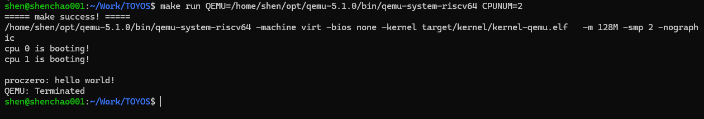
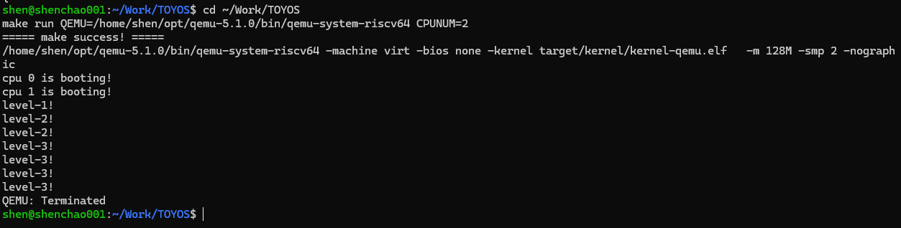
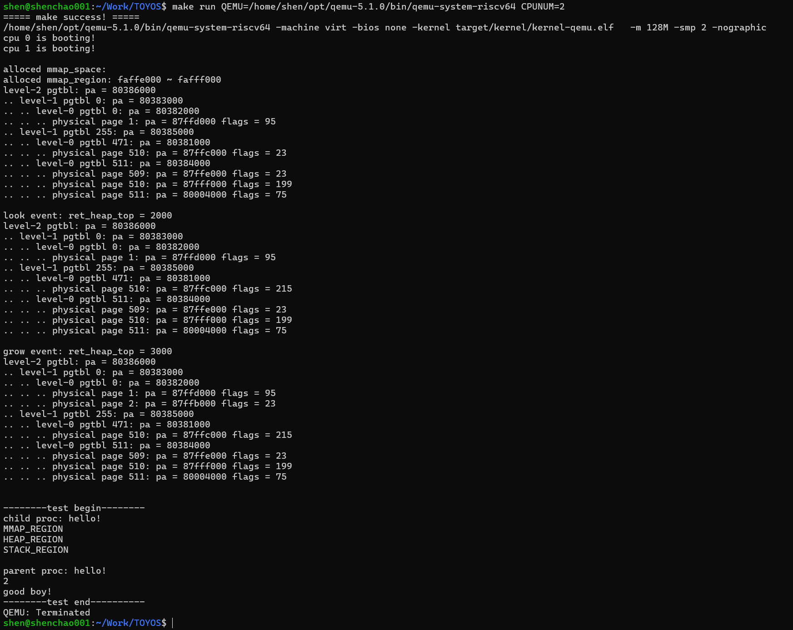
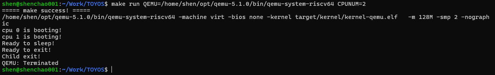

## Lab-6：进程调度与生命周期

### 1. 实验目标

Lab-6 在 Lab-5 已具备用户地址空间复制和销毁能力的基础上，将单个 `proczero` 扩展为最多 32 个进程，实现基于时钟抢占的多进程调度，并补齐 `fork`、`wait`、`exit`、`sleep` 与睡眠锁

本实验完成以下功能：

1. 建立进程数组、五种进程状态和每个进程独立的内核栈。
2. 使用循环扫描调度器在双 hart 上选择 `RUNNABLE` 进程。
3. 通过时钟中断触发进程让出 CPU，实现抢占式调度。
4. 实现进程复制、退出、等待回收和孤儿进程过继。
5. 实现睡眠、唤醒、定时等待以及内核睡眠锁。

### 2. 进程模型与调度

系统使用固定大小的 `proc_list[N_PROC]` 管理进程槽位，`N_PROC` 为 32。每个进程包含 PID、名称、父进程、退出码、睡眠资源、用户页表、trapframe、内核栈和内核上下文。共享状态由进程自身的自旋锁保护

`proc_scheduler()` 在每个 hart 上循环扫描进程数组。选中进程后，调度器持有该进程锁，将状态改为 `RUNNING`，设置 `cpu->proc` 并执行 `swtch()`。进程通过 `proc_sched()` 回到本 hart 的调度上下文，调度器随后清空 `cpu->proc` 并释放进程锁

首次调度的新进程从 `proc_return()` 开始执行，由它释放创建阶段保留的进程锁，再进入 `trap_user_return()`。这保证了新进程与已经运行过的进程遵循同一套锁交接规则

### 3. fork、exit 与 wait

`proc_fork()` 使用 `proc_alloc()` 申请子进程，并完成以下复制：

- 深复制代码、堆、用户栈和全部 mmap 物理页面；
- 为子进程复制 mmap 区域描述链表；
- 复制 trapframe，并将子进程的 `a0` 设置为 0；
- 建立父子关系，将子进程设置为 `RUNNABLE`；
- 父进程获得子进程 PID。

`proc_exit()` 保存退出码，将当前进程置为 `ZOMBIE`，随后切换回调度器。进程不能释放正在使用的内核栈和运行现场，因此最终资源回收由父进程在 `proc_wait()` 中完成

父进程提前退出时，`proc_reparent()` 将它的子进程过继给长期运行的 `proczero`。`wait_lk` 保护父子关系以及 wait/exit 的检查与唤醒顺序，避免父进程准备睡眠时错过子进程的退出通知

### 4. 睡眠、唤醒与定时等待

`proc_sleep(resource, lk)` 在持有当前进程锁后释放条件锁，将状态设置为 `SLEEPING` 并进入调度器。被唤醒后，它重新取得调用者原先持有的锁再返回。这个顺序使“条件检查—进入睡眠”与“条件变化—发出唤醒”能够正确配合。

`proc_wakeup(resource)` 扫描进程数组，将等待同一资源的进程改为 `RUNNABLE`

系统时钟使用 `sys_timer` 作为等待资源：

```text
SYS_sleep(ntick)
    -> timer_wait(ntick)
    -> proc_sleep(&sys_timer, &sys_timer.lk)
    -> CPU0 timer_update()
    -> proc_wakeup(&sys_timer)
```

只有 CPU0 更新全局 tick，两个 hart 都会处理各自的时钟中断并让当前用户进程交出时间片。内核态时钟路径仅在存在 `RUNNING` 进程且没有持锁时触发让出，并在可能的调度后恢复 `sepc` 和 `sstatus`

### 5. 睡眠锁

睡眠锁使用内部自旋锁保护 `locked`、持有者 PID 和名称。获取失败的进程调用 `proc_sleep()`，释放者清除持有状态并调用 `proc_wakeup()`。这种锁适用于持有时间较长的资源，可避免等待进程持续占用 CPU 忙等

临时双 hart 竞争测试中，父子进程竞争同一把睡眠锁。持锁进程主动睡眠 3 个 tick，等待者进入 `SLEEPING`；释放后等待者成功获得锁。PID 2 和 PID 1 依次通过获取、持有和释放断言，全程没有 panic。临时测试代码已删除

### 6. 新增系统调用

Lab-6 正式系统调用号如下：

| 编号 | 系统调用        | 功能                       |
| ---- | --------------- | -------------------------- |
| 4    | `SYS_print_str` | 打印用户字符串             |
| 5    | `SYS_print_int` | 打印 32 位整数             |
| 6    | `SYS_getpid`    | 获取当前进程 PID           |
| 7    | `SYS_fork`      | 复制当前进程               |
| 8    | `SYS_wait`      | 等待并回收一个子进程       |
| 9    | `SYS_exit`      | 保存退出码并结束当前进程   |
| 10   | `SYS_sleep`     | 睡眠指定数量的系统时钟周期 |

Lab-5 的 `brk`、`mmap` 和 `munmap` 保持编号 1～3。个人 Lab-5 的三个数据传输测试入口保留为 11～13，避免破坏已有回归

### 7. 实验联系

| 实验  | 主要能力                             | 为 Lab-6 提供的基础                         |
| ----- | ------------------------------------ | ------------------------------------------- |
| Lab-1 | 双 hart 启动、UART 和自旋锁          | 提供并发执行、输出和共享状态保护。          |
| Lab-2 | 物理内存、Sv39 页表和内核虚拟地址    | 提供用户页复制和每进程内核栈映射。          |
| Lab-3 | 用户/内核 trap、外部中断和时钟中断   | 提供抢占调度和定时唤醒入口。                |
| Lab-4 | 首个用户进程、上下文切换和系统调用    | 提供进程运行现场和用户态入口。              |
| Lab-5 | 堆栈、mmap、页表复制与销毁            | 提供 fork 深复制和退出回收所需的内存能力。  |
| Lab-6 | 调度、生命周期、睡眠唤醒和睡眠锁      | 形成可创建、运行、等待和回收的多进程系统。  |

### 8. 验证记录

所有正式测试均使用 QEMU 5.1.0 和双 hart：

```bash
make build
make run QEMU=/home/shen/opt/qemu-5.1.0/bin/qemu-system-riscv64 CPUNUM=2
```

最终内核依次切换四个官方 `initcode.c` 完成回归，之后恢复并保留 Test4：

| 测试   | 验证目标                        | 实际结果                                         |
| ------ | ------------------------------- | ------------------------------------------------ |
| Test 1 | getpid 与用户字符串输出         | `proczero: hello world!` 仅出现 1 次。            |
| Test 2 | 两次 fork 与抢占调度             | `level-1/2/3` 分别出现 1、2、4 次。               |
| Test 3 | 地址空间深复制、exit 与 wait     | 三类区域均正确，PID 为 2，退出码判断为 good boy。 |
| Test 4 | 定时睡眠、唤醒、exit 与 wait     | 依次输出 sleep、exit、Child exit，无 panic。      |

Test1：



Test2：



Test3：



Test4 最终输出：

```text
cpu 0 is booting!
cpu 1 is booting!
Ready to sleep!
Ready to exit!
Child exit!
```

Test4：



