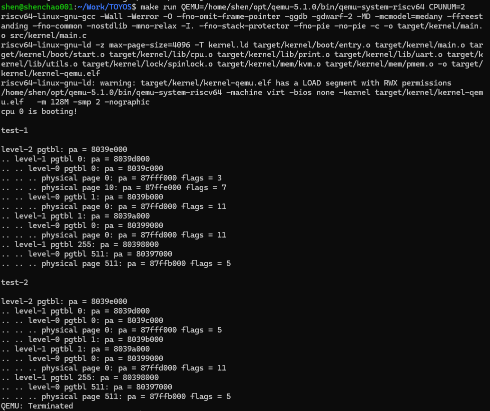
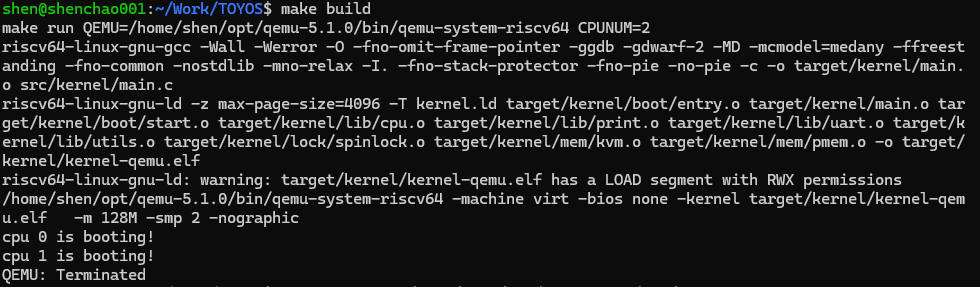

## 个人完成记录：Lab-2 内存管理初步

### 1. 实验目标

本实验在 Lab-1 已完成双核启动、S-mode 切换、UART 格式化输出与自旋锁的基础上，开始管理内核运行所依赖的内存资源。

共有两个核心部分：

1. 物理内存管理：将可分配内存按 4 KiB 切分为物理页，并使用空闲链表管理申请与释放
2. 内核态虚拟内存：基于 RISC-V Sv39 三级页表建立映射，并为每个 CPU 启用共享的内核页表

### 2. 与前序实验的逻辑联系

Lab-1 解决了“内核如何启动并在两个 CPU 上安全输出”的问题。Lab-2 在此基础上解决“内核如何管理内存”的问题

启动链路中的关系如下：

```text
Lab-1
机器启动 → 进入 S-mode → 双核同步 → UART 输出 → spinlock

Lab-2
物理页分配 → 页表建立 → satp 启用 Sv39 → CPU 通过虚拟地址访问内存
```

Lab-1 实现的自旋锁在本实验继续用于保护空闲物理页链表，避免两个 CPU 同时申请或归还页面时破坏链表结构。Lab-1 的双核同步机制保证 CPU 0 完成物理内存和内核页表初始化后，CPU 1 再启用同一张内核页表。

### 3. 新增功能与实现效果

#### 3.1 物理内存管理

链接脚本将物理内存划分为内核代码区、内核数据区和可分配物理页区：

```text
0x80000000 ~ KERNEL_DATA    内核代码
KERNEL_DATA ~ ALLOC_BEGIN   内核数据
ALLOC_BEGIN ~ ALLOC_END     可分配物理页
```

可分配区域中的每个物理页大小为 4 KiB，并被划分为内核页区域与用户页区域。每个区域包含起止地址、空闲页数量、空闲链表头和保护该区域的自旋锁。

实现了以下接口：

- `pmem_init()`：初始化内核页区域和用户页区域，并将全部空闲页加入对应链表
- `pmem_alloc(bool in_kernel)`：从指定区域的链表头申请一个页，将其清零后返回
- `pmem_free(uint64 page, bool in_kernel)`：将物理页归还到对应区域的空闲链表头

两个 CPU 可以并行申请和释放内核页，链表操作由 spinlock 保护。内存耗尽时会触发 `panic`，防止内核继续在错误状态下运行。

#### 3.2 Sv39 三级页表

实现了 RISC-V Sv39 页表管理的基础操作：

- `vm_getpte()`：根据虚拟地址逐级查找末级 PTE，并可按需申请中间页表
- `vm_mappages()`：为 `[va, va + len)` 与 `[pa, pa + len)` 建立映射或更新映射权限
- `vm_unmappages()`：解除指定虚拟地址范围的映射，并可归还对应的用户物理页
- `kvm_init()`：创建共享内核页表，映射 UART、CLINT、PLIC、内核代码区、内核数据区和可分配物理页区
- `kvm_inithart()`：每个 CPU 将共享内核页表写入 `satp`，并通过 `sfence.vma` 刷新 TLB

当前内核采用直接映射：虚拟地址与物理地址数值相同。虽然地址数值相同，内存访问已经由页表和 MMU 负责翻译与权限控制。

### 4. 验证结果

#### 4.1 页表映射与解映射

使用测试页表建立多组映射，随后更新虚拟地址 `0` 的权限，并解除两组映射。`vm_print()` 输出显示：

- 初始映射具有预期的读、写、执行权限
- 虚拟地址 `0` 的标志从 `3` 更新为 `5`，对应从 `PTE_V | PTE_R` 更新为 `PTE_V | PTE_W`
- 被解除映射的页不再出现在末级物理页输出中



#### 4.2 最终双核启动

使用 QEMU 5.1.0 和两个 CPU 启动。CPU 0 初始化物理页分配器与共享内核页表，两个 CPU 均成功启用内核页表并输出启动信息

```bash
make build
make run QEMU=/home/shen/opt/qemu-5.1.0/bin/qemu-system-riscv64 CPUNUM=2
```


