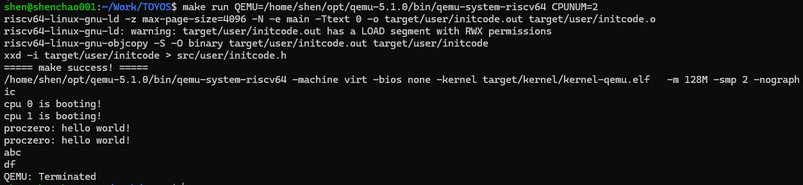
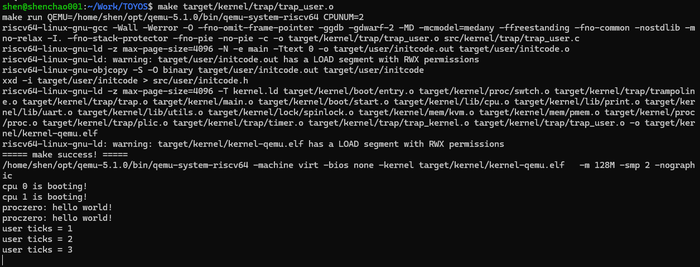

## Lab-4：第一个用户态进程

### 1. 实验目标

Lab-4 在 Lab-1 的启动与同步、Lab-2 的内存管理和 Lab-3 的 trap 框架之上，引入第一个用户态进程 `proczero`。内核能够创建用户进程的 PCB 与地址空间，将执行流从 S-mode 切换到 U-mode；用户程序随后通过 `ecall` 发起系统调用，内核处理后再返回用户态继续执行

本实验的核心验收效果是：用户程序连续发出两次 `SYS_helloworld` 系统调用，内核输出两次：

```text
proczero: hello world!
```

### 2. 新增功能与实现效果

#### 2.1 用户程序构建与嵌入

新增 `src/user/initcode.c`、系统调用封装头文件和 Makefile 构建规则。`initcode.c` 会先被编译为独立的 RISC-V 用户程序，再转换为 `initcode.h` 中的字节数组，并嵌入内核镜像。

这样，内核启动后无需外部文件系统，就能获得第一个待运行的用户程序。构建过程中生成的 `src/user/initcode.h` 属于自动生成文件，不纳入版本控制

#### 2.2 PCB 与用户虚拟地址空间

新增进程模块，使用 `proc_t` 记录第一个用户进程的关键资源：

- `pgtbl`：用户页表；
- `heap_top` 与 `ustack_npage`：用户堆顶和用户栈页面数量；
- `tf`：保存用户寄存器和内核返回环境的 trapframe；
- `kstack`：用户进程陷入内核后使用的内核栈；
- `ctx`：内核上下文切换时保存的寄存器状态

`proc_make_first()` 创建 `proczero`，为其分配 trapframe、用户页表、用户代码与数据页、用户栈，并设置用户入口地址和用户栈顶

用户地址空间的主要布局如下：

```text
高地址
TRAMPOLINE                 用户页表和内核页表共享的跳板代码
TRAPFRAME                  保存用户寄存器和内核返回环境，U-mode 无权访问
用户栈                    1 个用户页，栈从高地址向低地址增长
空闲区域                  为后续堆空间扩展预留
USER_BASE                  initcode 的代码和数据页
低地址 0x0                保持未映射
```

内核页表同时映射 trampoline 和 `KSTACK(0)`，使用户态和内核态切换前后都能保持连续执行

#### 2.3 内核上下文与特权级上下文切换

新增 `swtch.S`，用于在内核自身上下文和 `proczero.ctx` 之间保存、恢复 callee-saved 寄存器。CPU0 在完成共享资源、页表和 trap 初始化后，调用 `proc_make_first()`；随后通过 `swtch()` 进入 `proczero` 的内核上下文。

`trap_user_return()` 准备用户态运行所需的内核信息，设置用户 trap 向量和 `sstatus`，再进入 trampoline 中的 `user_return`。`user_return` 切换到用户页表、恢复用户寄存器，并使用 `sret` 进入 U-mode

#### 2.4 用户态 trap、系统调用与中断返回

新增 `trampoline.S` 与 `trap_user.c`：

- `user_vector` 在用户态发生 trap 后保存通用寄存器到 trapframe，切换内核页表和内核栈；
- `trap_user_handler()` 读取 `scause`，分发系统调用、UART 外部中断和时钟中断；
- `trap_user_return()` 恢复用户态运行环境；
- `user_return` 切换回用户页表，恢复用户寄存器后通过 `sret` 返回用户程序

用户态执行 `ecall` 时，RISC-V 产生原因码为 8 的异常。内核读取 trapframe 中 `a7` 保存的系统调用号，响应 `SYS_helloworld`；随后将保存的用户 PC 增加 4，跳过已执行的 `ecall` 指令，避免重复陷入

Lab-3 已实现的 UART 和时钟中断处理函数在 Lab-4 中继续复用。用户态发生外部中断或时钟中断后，同样可以进入内核处理并返回原用户执行流。

### 3. 与前三个实验的逻辑联系

Lab-1～Lab-4 构成从“启动内核”到“运行第一个用户进程”的递进过程：

| 实验  | 已完成能力                                     | 为 Lab-4 提供的基础                                                      |
| ----- | ---------------------------------------------- | ------------------------------------------------------------------------ |
| Lab-1 | 启动链、双 hart 启动、UART 输出、自旋锁        | `printf` 用于系统调用和诊断输出；双 hart 初始化流程继续保留。            |
| Lab-2 | 物理页分配、Sv39 内核页表、设备映射            | 为用户页表、代码页、用户栈、trapframe 和内核栈分配并建立映射。           |
| Lab-3 | trap、UART 输入中断、时钟中断                  | 提供内核态 trap 基础，并让用户态 trap 可以复用 UART 和时钟中断处理路径。 |
| Lab-4 | PCB、用户页表、上下文切换、用户 trap、系统调用 | 内核首次能够创建、运行并管理一个用户态进程。                             |

Lab-4 将前三个实验形成的基础设施组织为完整执行链：Lab-1 让 CPU 启动并输出信息，Lab-2 提供独立地址空间所需的内存能力，Lab-3 提供控制流进入内核的 trap 机制，Lab-4 则让用户程序真正运行并使用内核服务

### 4. 验证记录

运行环境：

```bash
make build
make run QEMU=/home/shen/opt/qemu-5.1.0/bin/qemu-system-riscv64 CPUNUM=2
```

使用 QEMU 5.1.0 和双 hart 配置启动。构建成功后，已核对内核为 ELF64 RISC-V 镜像，入口地址为 `0x80000000`，并包含 `proc_make_first`、`swtch`、`trampoline`、`user_vector`、`user_return` 和 `trap_user_handler` 等关键符号

#### 4.1 用户进程、系统调用与 UART 输入测试

运行后，CPU0 与 CPU1 均输出启动信息。`proczero` 进入用户态后连续两次发出 `SYS_helloworld`，内核正确输出两次 hello world。

在用户态循环期间，输入普通字符 `abc` 能正常回显；输入 `de`、Backspace、`f` 后终端最终显示 `df`。该结果说明 UART 外部中断能够从用户态进入内核，完成 PLIC 与 UART 处理后再返回用户态。



#### 4.2 用户态时钟中断测试

为了区分用户态与内核态的时钟中断路径，临时在 `trap_user_handler()` 的用户态时钟中断分支中记录前三次 tick。运行时连续观察到：

```text
user ticks = 1
user ticks = 2
user ticks = 3
```

证明用户态循环期间，时钟中断能够进入 `user_vector`、`trap_user_handler()`，复用 Lab-3 的时钟处理逻辑后回到用户程序。验证完成后已删除临时打印代码，并重新构建运行


