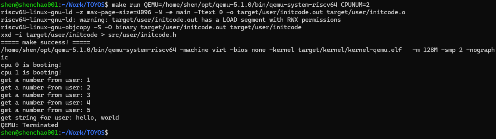
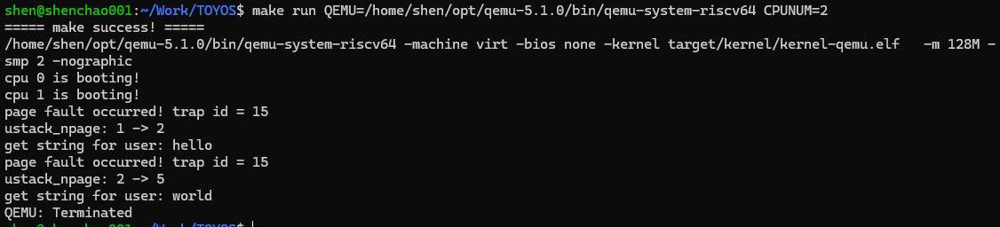
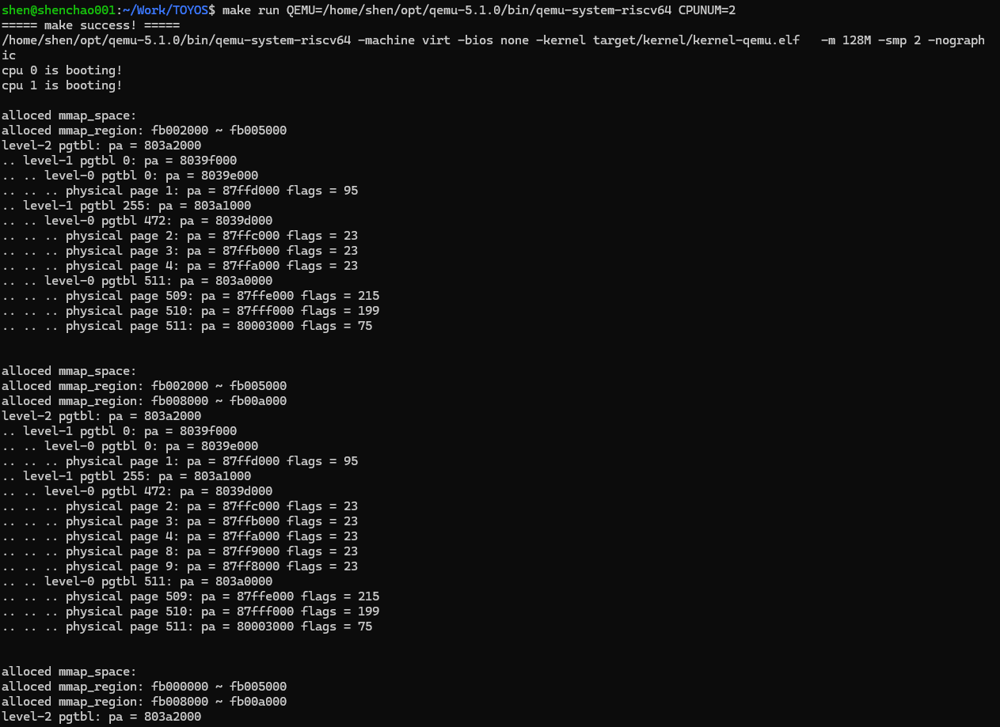
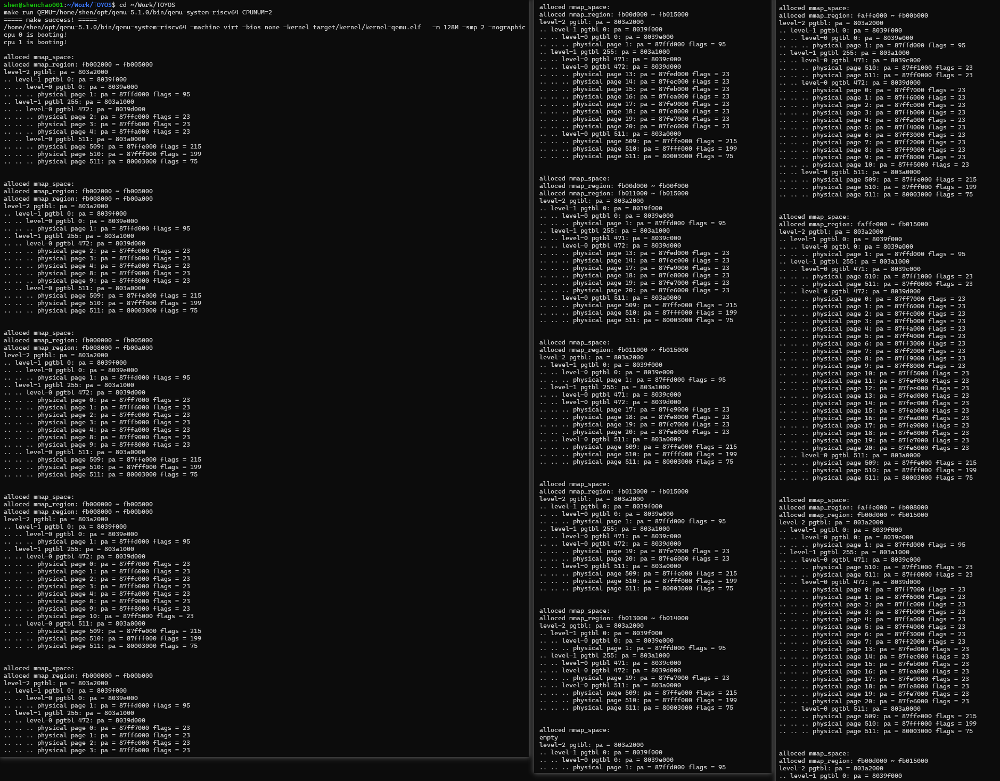

## Lab-5：用户内存管理

### 1. 实验目标

Lab-5 在 Lab-4 已经能够创建并运行第一个用户进程的基础上，进一步完善用户地址空间管理。实验实现了系统调用参数传递、用户堆与栈的动态扩展、mmap 区域管理、用户页表复制和页表销毁，使内核能够管理用户进程运行期间动态变化的虚拟内存

本实验完成以下五项任务：

1. 在用户页表和内核之间安全复制数据，并完善通用系统调用分发。
2. 通过 `brk` 调整用户堆顶，并在用户栈缺页时自动扩展栈空间。
3. 建立带自旋锁保护的 `mmap_region` 节点仓库。
4. 实现 mmap 区域的 first-fit 分配、相邻区域合并和四类区间释放。
5. 实现用户页表的独立复制与递归销毁。

Lab-5 完成后的用户地址空间主要布局如下：

```text
高地址
TRAMPOLINE                         全进程共享的用户态陷入跳板
TRAPFRAME                          每个进程独立的寄存器保存页
用户栈                             从 TRAPFRAME 向低地址按需扩展
MMAP_END
mmap 区域                          使用有序链表记录已分配区间
MMAP_BEGIN
空闲区域
用户堆                             从 initcode 页面之后向高地址增长
USER_BASE                          initcode 的代码和数据页
低地址 0x0                         保持未映射
```

### 2. 新增功能与实现效果

#### 2.1 系统调用分发与用户数据复制

系统调用入口根据 trapframe 中保存的系统调用号查找处理函数，将返回值写回用户寄存器。新增以下用户地址空间复制函数：

- `uvm_copyin()`：从用户虚拟地址复制数据到内核地址
- `uvm_copyout()`：从内核地址复制数据到用户虚拟地址
- `uvm_copyin_str()`：从用户空间复制以 `\0` 结尾的字符串

复制过程通过用户页表逐页查找物理地址，并检查 `PTE_V`、`PTE_U` 以及相应的读写权限。跨页数据会按当前页面剩余长度分段复制，避免直接使用未经转换的用户虚拟地址

对应的测试系统调用成功读取用户数组中的 1～5，并从用户空间复制字符串 `hello, world`

#### 2.2 用户堆与自动栈扩展

`sys_brk()` 根据目标堆顶调用 `uvm_heap_grow()` 或 `uvm_heap_ungrow()`。堆顶以字节为单位记录，实际物理页分配和释放按页边界进行。initcode 所在页面始终保留，堆空间不能进入预留的 mmap 区域。

用户栈从 `TRAPFRAME` 下方向低地址增长。用户态发生原因码为 13 或 15 的缺页异常时，内核检查故障地址是否位于允许扩展的栈区间，并通过 `uvm_ustack_grow()` 一次补齐缺失页面。栈最多增长到 `MMAP_END`，从而避免与 mmap 区域重叠。

堆测试得到以下结果：

```text
look:   0x2000
grow:   0xb000
equal:  0xb000
ungrow: 0x6000
```

栈测试连续触发两次缺页，栈页面数量从 1 增加到 2，再从 2 增加到 5；跨页字符串 `hello` 和 `world` 均能被内核正确读取。

#### 2.3 mmap 节点仓库

`mmap_region_t` 用于记录进程已经分配的 mmap 地址区间。内核建立固定容量的公共节点仓库，并使用自旋锁保护节点申请与归还操作：

- `mmap_init()` 初始化全部空闲节点。
- `mmap_region_alloc()` 从空闲链表申请一个节点。
- `mmap_region_free()` 将节点归还仓库。
- 非法节点、重复释放和节点耗尽会进入明确的 panic 路径。

临时双 hart 压力测试中，两个 hart 分别申请并释放 128 个节点，随后能够再次遍历到完整的 256 个空闲节点。测试期间没有出现 double-free、死锁或节点丢失。压力测试代码在验证完成后已删除。

#### 2.4 mmap 分配与释放

每个进程的 mmap 链表按虚拟地址升序排列，链表节点描述已经分配的连续区间。

当 `start == 0` 时，`uvm_mmap_find()` 从 `MMAP_BEGIN` 开始进行 first-fit 扫描，选择第一个能够容纳目标长度的空隙。指定起始地址时，内核检查页对齐、地址边界以及与左右节点的重叠关系。

新区域插入链表后，会尽量与相邻区域合并：

- 与左侧区域相邻时保留左侧节点；
- 与右侧区域相邻时合并右侧节点；
- 同时连接左右区域时，最终形成一个连续节点。

每个 mmap 页面通过 `pmem_alloc()` 获得独立物理页，并使用以下用户权限建立映射：

```c
PTE_R | PTE_W | PTE_U
```

`vm_mappages()` 会同时加入 `PTE_V`，因此测试中页面权限标志为十进制 `23`。

`uvm_munmap()` 在找到完整包含目标区间的节点后处理四类情况：

1. 释放整个节点并将其归还节点仓库。
2. 释放节点前部，向后移动区域起点。
3. 释放节点后部，缩短页面数量。
4. 释放节点中间，将原节点拆分为左右两个节点。

链表更新完成后，`vm_unmappages(..., true)` 解除对应页表映射并归还用户物理页

#### 2.5 用户页表复制与销毁

`uvm_copy_pgtbl()` 使用 `copy_range()` 分别复制以下地址范围：

- `[USER_BASE, heap_top)` 中的 initcode 页面和连续用户堆；
- trapframe 下方已经分配的用户栈页面；
- mmap 链表中记录的全部已分配区域。

每个源页面都会申请新的目标物理页，复制完整页面内容并保留原页表权限。源页表和目标页表拥有相同的初始数据，但底层物理页相互独立。trapframe 由新进程单独分配，trampoline 继续共享，因此这两个高地址页面不进入普通用户空间复制范围

`uvm_destroy_pgtbl()` 首先释放进程独有的 trapframe 映射，只解除共享 trampoline 的映射；随后从三级 Sv39 顶级页表开始递归遍历。中间页表项继续递归，末级叶子项释放对应用户物理页，各级页表页最终归还内核物理页池。

临时测试构造了独立目标页表，并对代码页、用户栈和 23 个 mmap 页面逐页检查内容、权限与物理地址

### 3. 与前四个实验的逻辑联系

Lab-1～Lab-5 逐步建立了从内核启动到用户地址空间动态管理的完整基础：

| 实验  | 已完成能力                                     | 为 Lab-5 提供的基础                                    |
| ----- | ---------------------------------------------- | ------------------------------------------------------ |
| Lab-1 | RISC-V 启动链、双 hart 启动、UART 输出和自旋锁 | 提供调试输出、并发初始化和 mmap 节点仓库所需的锁机制。 |
| Lab-2 | 物理页管理、Sv39 页表和设备映射                | 提供用户页分配、页表查询、页面映射与解除映射能力。     |
| Lab-3 | trap、UART 外部中断和时钟中断                  | 提供用户缺页异常进入内核并得到处理的底层路径。         |
| Lab-4 | 第一个用户进程、用户页表、上下文切换和系统调用 | 提供可持续运行的用户进程及系统调用入口。               |
| Lab-5 | 数据复制、堆栈扩展、mmap、页表复制与销毁       | 用户地址空间能够在运行期间动态增长、分配、复制和回收。 |

整体执行关系为：

```text
Lab-1 启动和同步
        ↓
Lab-2 物理内存与 Sv39 页表
        ↓
Lab-3 trap 与中断
        ↓
Lab-4 用户进程与系统调用
        ↓
Lab-5 用户地址空间生命周期管理
```

### 4. 验证记录

#### 4.1 构建与运行环境

QEMU 5.1.0 和双 hart 配置：

```bash
make build
make run QEMU=/home/shen/opt/qemu-5.1.0/bin/qemu-system-riscv64 CPUNUM=2
```

#### 4.2 系统调用数据复制

用户程序连续传入 1～5，并向内核传递字符串 `hello, world`。内核通过用户页表完成地址转换和权限检查后，正确输出全部数据：



#### 4.3 用户栈缺页扩展

测试连续触发两次用户栈缺页。内核识别原因码 15，将用户栈从 1 页扩展到 2 页，再一次扩展到 5 页，随后成功读取跨页放置的字符串：



#### 4.4 mmap 权限与链表变化

mmap 测试按不同顺序插入多个地址区间。页表输出中的 mmap 页面均显示 `flags = 23`，对应有效、用户、可读和可写权限：



完整测试首先通过相邻合并形成从 `MMAP_BEGIN` 开始的连续 23 页区域，随后依次验证中间拆分、整段删除、前部删除和后部删除。最终链表输出为：

```text
alloced mmap_space:
empty
```

完整链表和页表变化记录如下：


