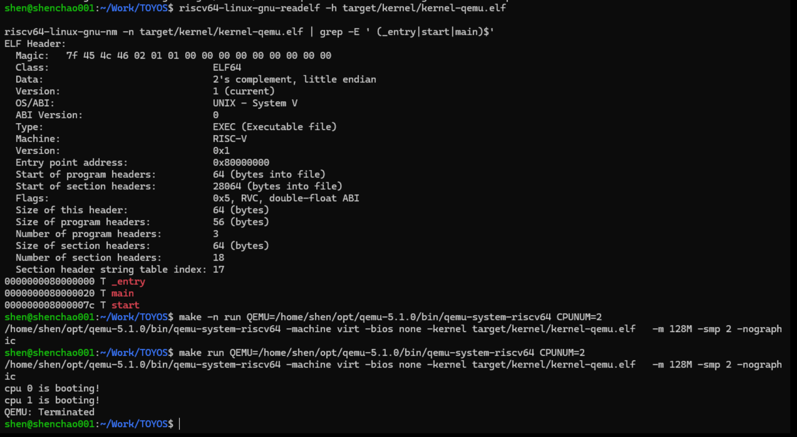

# Lab-1：双核机器启动、串口输出与自旋锁

## 1. 实验目标

Lab-1 的目标是让内核从 QEMU 启动，完成从 RISC-V M-mode 到 S-mode 的切换，并在两个 CPU（hart）上进入内核 `main()` 函数。

最终在 QEMU 5.1.0 的双核环境中，内核输出为：

```text
cpu 0 is booting!
cpu 1 is booting!
```

## 2. 新增功能与实现效果

### 2.1 启动链路：M-mode 进入 S-mode

在 `src/kernel/boot/start.c` 中补全启动的最后两步：将 `main()` 地址写入 `mepc`，再执行 `mret`。进入 `start()` 前，汇编入口已经为每个 CPU 分配了初始栈；`start()` 会关闭分页、读取 `mhartid` 并保存到 `tp`，随后把 `mstatus.MPP` 设置为 S-mode。

因此，`mret` 返回后，每个 CPU 都会以 S-mode 运行 `main()`，内核具备了后续初始化所需的基本运行环境。

### 2.2 串口与格式化输出

在 `src/kernel/lib/print.c` 中实现了 `printf()`、`panic()` 和 `assert()`。`printf()` 使用 UART 驱动逐字符输出，并支持下列格式：

- `%d`：32 位有符号十进制整数。
- `%p`：32 位无符号十六进制整数。
- `%x`：以 `0x` 开头的 64 位十六进制整数。
- `%c`、`%s` 与 `%%`：字符、字符串和百分号。

这让内核在尚未拥有标准 C 库的早期启动阶段，也可以输出调试信息；`panic()` 与 `assert()` 则为后续实验提供了基础的错误停机机制。

### 2.3 自旋锁与中断保护

在 `src/kernel/lock/spinlock.c` 中实现了自旋锁的初始化、获取、释放和持有状态检查。

获取锁时会先通过 `push_off()` 关闭当前 CPU 的设备中断并记录嵌套层数，随后使用原子交换操作竞争锁；释放锁前会检查当前 CPU 确实持有该锁，并在释放后通过 `pop_off()` 按原始状态恢复中断。锁中还记录持有者 CPU 编号，便于发现重复加锁或错误释放等问题。

`printf()` 在完整输出一条字符串前获取 `print_lk`，输出完成后释放它。这样两个 CPU 同时输出时，一条消息不会被另一条消息的字符打断。

### 2.4 双核初始化与同步

在 `src/kernel/main.c` 中，CPU 0 负责初始化 UART 和打印锁，然后通过内存屏障设置 `started` 标志；CPU 1 在观察到该标志前持续等待。

该顺序确保 CPU 1 调用 `printf()` 时，UART 和自旋锁已经完成初始化。两个 CPU 随后各自输出启动信息，并进入循环等待后续实验继续扩展内核功能。

## 3. 验证结果

### 3.1 编译与 ELF 检查

项目通过 `make build` 成功生成 `target/kernel/kernel-qemu.elf`。使用 `readelf` 与 `nm` 检查得到：目标文件是 RISC-V 64 位可执行文件，入口地址为 `0x80000000`，且 `_entry`、`main`、`start` 的符号地址符合启动链路预期。

### 3.2 双核 QEMU 启动

使用 QEMU 5.1.0，以两个 CPU 启动：

```bash
make run QEMU=/home/shen/opt/qemu-5.1.0/bin/qemu-system-riscv64 CPUNUM=2
```

结果说明双核启动、M-mode 到 S-mode 的迁移、CPU 间初始化同步和 UART 输出均已生效。



## 4. 与前序实验的逻辑联系

Lab-0 完成了交叉编译工具链、QEMU 和 xv6 的环境验证，回答的是“实验环境能否正确编译并运行 RISC-V 内核”。Lab-1 则开始编写自己的内核基础设施，回答的是“内核如何从机器启动、切换特权级，并在多 CPU 上安全地输出信息”。

```text
Lab-0：准备并验证 RISC-V 开发环境
   ↓
Lab-1：启动内核 → 进入 S-mode → 初始化 UART/锁 → 双核安全输出
```


